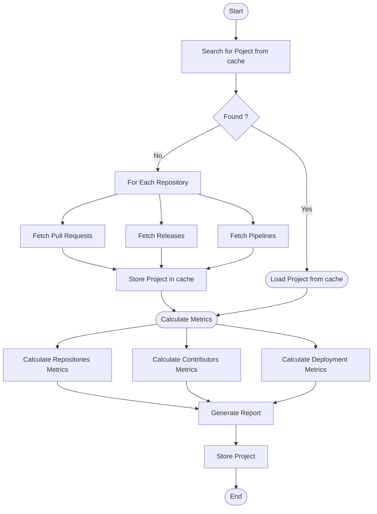
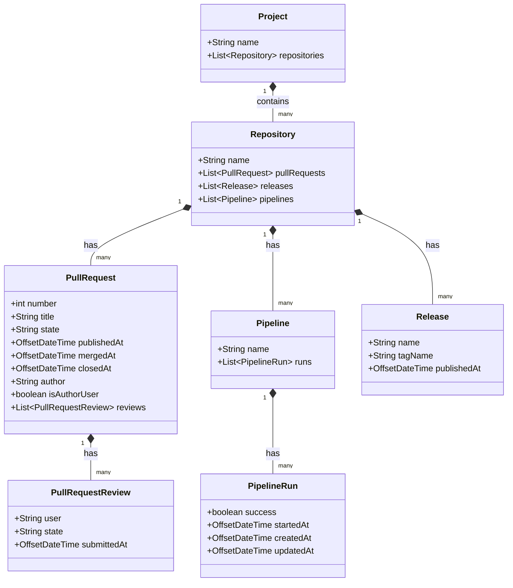

A command-line tool that generates development metrics reports from one or more Git repositories. It analyses pull
requests, releases, and CI/CD pipelines to surface contribution patterns, deployment health, and team activity over
time.

## Commands

Every invocation requires the following global argument:

| Argument    | Required | Description                        |
|-------------|----------|------------------------------------|
| `--command` | Yes      | The name of the command to execute |

 
---

### `generate-report`

Generates a development metrics report for a given project, using one or more Git repositories as input. Results are
cached — subsequent runs for the same project load from cache instead of re-fetching.

**Arguments:**

| Argument  | Required | Type                | Description                                                                 |
|-----------|----------|---------------------|-----------------------------------------------------------------------------|
| `--name`  | Yes      | String              | The name of the project                                                     |
| `--repos` | Yes      | String (repeatable) | Repository identifier(s). Pass multiple times to include more than one repo |

**Usage:**

```
--command=generate-report --name=<project> --repos=<repo1> --repos=<repo2>
```

**Single repository:**

```bash
java -jar metrics.jar \
  --command=generate-report \
  --name=my-service \
  --repos=my-org/my-service
```

**Multiple repositories:**

```bash
java -jar metrics.jar \
  --command=generate-report \
  --name=MyProject \
  --repos=my-org/repo-a \
  --repos=my-org/repo-b \
  --repos=my-org/repo-c
```

 
---

## How It Works

On first run the tool fetches pull requests, releases, and pipeline data for every repository, stores the result in a
local cache, then calculates and outputs the report. Subsequent runs for the same project name skip the fetch step and
load directly from cache.



---

## Metrics

### Repository Metrics

Calculated individually for each repository.

**General**

| Metric              | Description                        |
|---------------------|------------------------------------|
| Total pull requests | Count of all PRs in the repository |
| Total releases      | Count of all tagged releases       |
| Total pipelines     | Count of all pipeline definitions  |

**Releases**

Each release is classified by its version tag:

| Type   | Pattern                               | Example |
|--------|---------------------------------------|---------|
| Change | `x.y.0` — patch number is `0`         | `1.4.0` |
| Hotfix | Any version where patch number `!= 0` | `1.4.3` |

**Pipelines**

For each pipeline definition:

| Metric               | Description                       |
|----------------------|-----------------------------------|
| Total runs           | Number of executions              |
| Success rate         | Percentage of runs that succeeded |
| Average run duration | Mean duration across all runs     |

 
---

### Contribution Metrics

Aggregated per contributor across all tracked repositories.

| Metric          | Description                                           |
|-----------------|-------------------------------------------------------|
| Merged PRs      | Total number of merged pull requests                  |
| Reviewed PRs    | Total number of pull requests reviewed                |
| First merged PR | Date of the contributor's first merged PR             |
| Most recent PR  | Date of the contributor's latest PR                   |
| Active status   | `true` if the most recent PR is less than 30 days old |
| Time to 10th PR | Duration between the first and 10th merged PR         |

 
---

### Deployment Metrics

Aggregated across all repositories in the project.

| Metric                    | Description                          |
|---------------------------|--------------------------------------|
| Total changes             | Number of `x.y.0` releases           |
| Total hotfixes            | Number of releases with patch `!= 0` |
| Total deployments         | Total changes + total hotfixes       |
| Change Failure Rate (CFR) | `hotfixes / deployments`             |

 
---

## Data Model

The following class diagram describes the internal data structures of a Project


